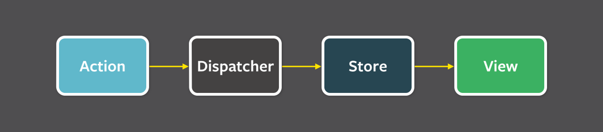
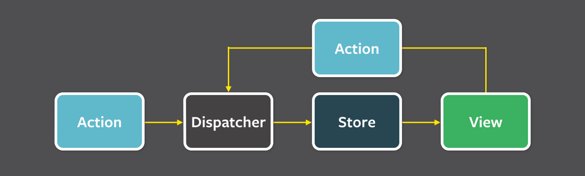

# Redux  

Redux는 대표적인 Flux 패턴을 사용하는 라이브러리입니다.  

> **Flux 패턴이란?**  
페이스북 개발팀에서 만든 새로운 디자인 패턴으로 단방향이라는 특징을 가지고 있어 양방향 패턴으로 인한 연쇄적인 문제점을 고쳤습니다. Flux 패턴은 아래 4가지로 구성되었습니다.  
  
> - Action: 어떤 변화를 발생시킬지 정의하는 `type` property와 변화에 필요한 데이터를 담고있는 단순한 객체입니다.
> - Dispatcher: Action을 받아서 모든 Store에 전달하는 역할을 수행합니다.
> - Store: 애플리케이션의 데이터를 저장하고, Dispatch에 전달된 Action에 따라 수정합니다.
> - View: Store에 저장된 데이터를 받아서, UI로 표현하고, 유저의 동작에 따라서 Action을 생성합니다.  
>
> 결과 다음과 같이 동작합니다.  
  

Redux는 Flux, CQRS, Event Sourcing의 개념을 사용해서 만든 라이브러리로서 “**JavaScript 앱을 위한 예측 가능한 상태 컨테이너**"를 핵심 가치로 삼고 있습니다.  

### Redux의 3가지 원칙

공부필요

### React에서의 Redux  
Redux가 JavaScript를 위해 존재하지만 React 역시 사용할 수 있습니다. 바로 `React-Redux`를 활용하는 것입니다. 사용 방법은 아래와 같습니다.  

1. Provider  
React 컴포넌트들에게 Redux Store에 접근할 수 있는 기능을 제공해주는 컴포넌트입니다. 내부적으로 Context API를 활용하고 있습니다.  
```js
import { Provider } from 'react-redux';
import store from './store/index';
import App from './App';


root.render(
  <Provider store={store}>
    <App />
  </Provider>
);
```  

2. useSelector  
컴포넌트에서 Redux Store의 값을 가져올 수 있는 hook입니다. Redux의 Selector를 React Hook으로 표현한 형태입니다.  
```js
import { useSelector } from 'react-redux';

const Counter = () => {
  const count = useSelector((state) => state.value);

  return <h1>{count}</h1>;
};
```  

3. useDispatch
컴포넌트에서 action을 store에 보내기 위한 dispatch 함수를 가져올 수 있는 hook입니다.  
```js
import { useSelector, useDispatch } from 'react-redux';

const Count = () => {
  const count = useSelector((state) => state.counter);
  const dispatch = useDispatch();

 const increase = () => {
    dispatch({ type: 'counter/increment' });
  };

  return (
    <div>
      <h1>{count}</h1>
      <button onClick={increase}>increment</button>
    </div>
  );
};

export default Count;
```  